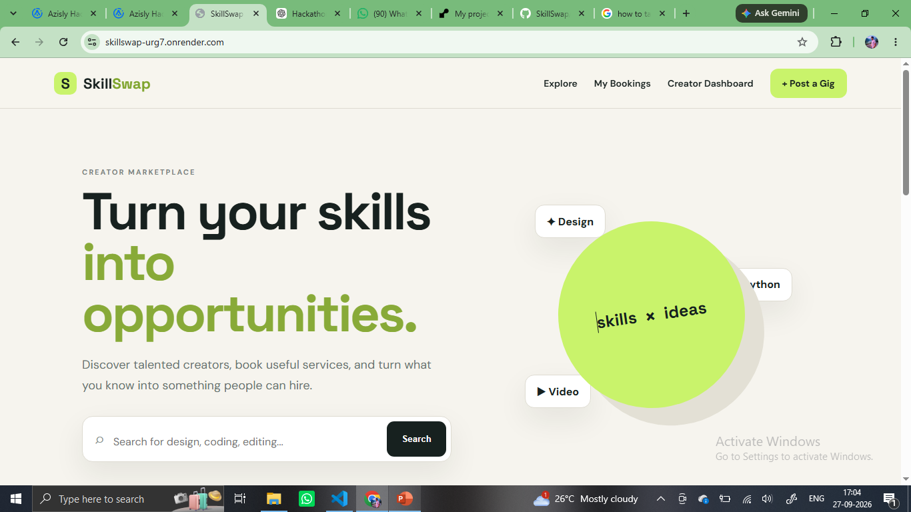
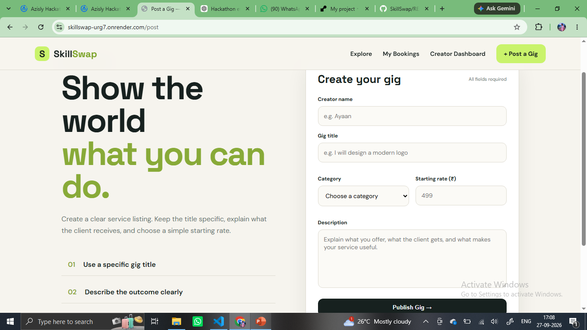
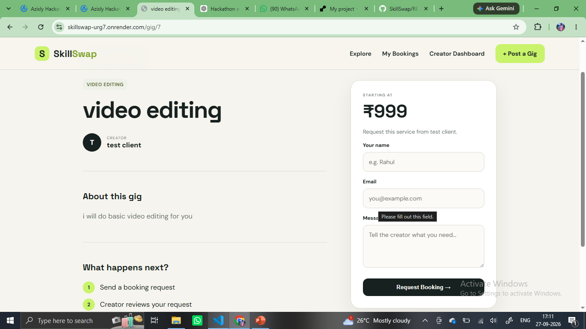
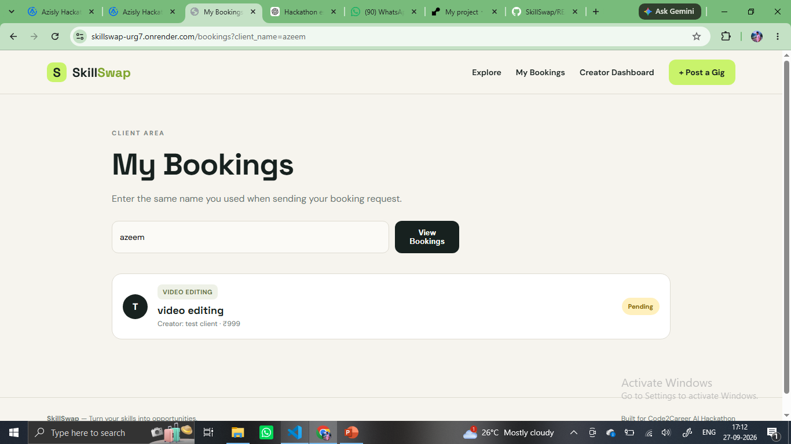
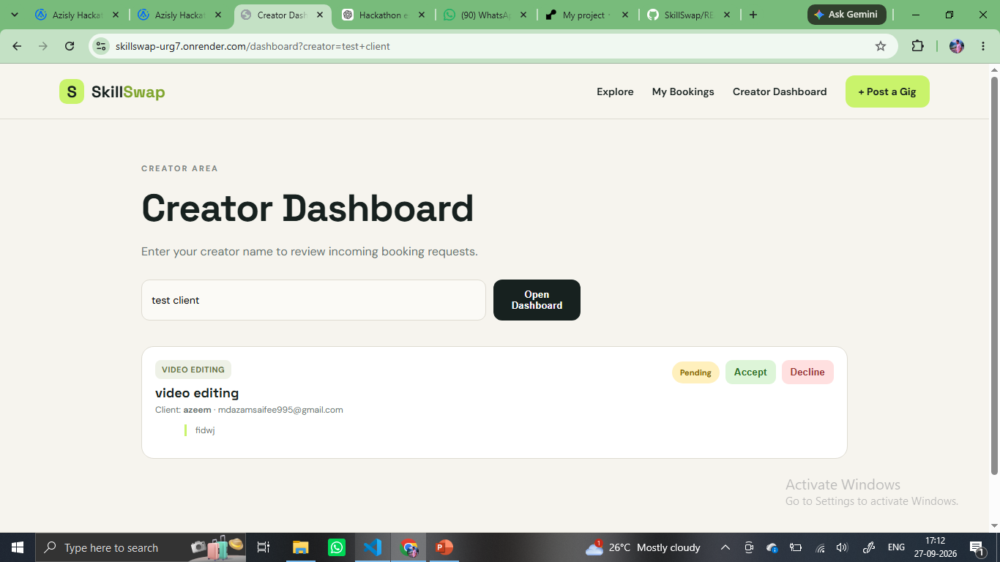

# SkillSwap — Code2Career AI Hackathon

A modern gig marketplace built for the **Code2Career AI Hackathon — Track 2: Web Development / Real-World AI Products**.

SkillSwap allows young creators to showcase their services and lets clients discover, book, and manage those services through a simple marketplace workflow.

## 🚀 Live Demo

**Live App:** `https://skillswap-urg7.onrender.com/`

**GitHub Repository:** `https://github.com/CODEDEMON090/SkillSwap`

**Hackathon ID** `AZIS-XACGV3`

---

## ✨ Features

SkillSwap implements all five required features from the Track 2 SkillSwap brief.

### 1. Post a Gig

Creators can publish a service by providing:

- Gig title
- Category
- Rate
- Description

### 2. Browse & Search

Clients can:

- Browse available gigs
- Search for gigs
- Filter gigs by category
- Open individual gig details

### 3. Book a Gig

Clients can select a gig and submit a booking request with their details and requirements.

New bookings initially appear with a:

**Pending** status.

### 4. Creator Dashboard

Creators can view incoming booking requests and manage them by:

- Accepting a booking
- Declining a booking

### 5. My Bookings

Clients can view their booking history and see the current status of each request:

- Pending
- Accepted
- Declined

---

## 🔄 Core Workflow

```text
Creator
   ↓
Post a Gig
   ↓
Gig appears in Marketplace
   ↓
Client discovers/searches for Gig
   ↓
Client submits Booking
   ↓
Booking = Pending
   ↓
Creator Dashboard
   ↓
Accept / Decline
   ↓
Client sees updated status


## 📸 Screenshots

### Marketplace


### Post a Gig


### Gig Details & Booking


### My Bookings


### Creator Dashboard
